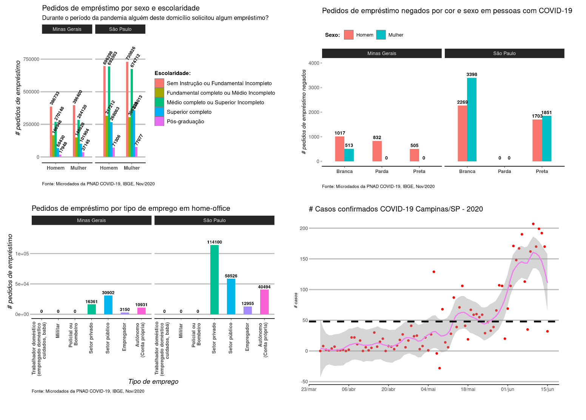

# Codes of course - Data Science: analysis and visualization of coronavirus data

Codes developed during the course **ACIEPE Extension Activity - Statistics for Data Science: analysis and visualization of coronavirus data**, offered by the Department of Economics of the Federal University of São Carlos (UFSCAR), 2020-2021.

To access the codes click here: <a href='https://rpubs.com/msc2020'>https://rpubs.com/msc2020</a>.

 

  

 