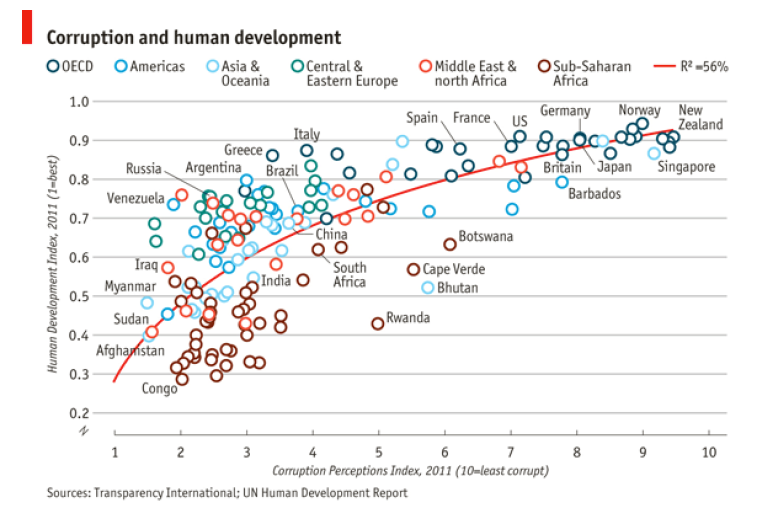

```{r setup, include=FALSE}
knitr::opts_chunk$set(echo = TRUE)
```

## Questão 1
Utilizando o conjunto de dados USArrests descrito na aula, construa um histograma para cada uma das variáveis contida nesse banco de dados. Use uma cor diferente para cada histograma. Construa também box-plots para cada uma das variáveis, com as mesmas cores usadas no histograma.

Resp:

```{r Q1}

library(ggplot2)
data(USArrests)
dataset <- USArrests
#names(dataset)
#head(dataset)
g1 <- ggplot(mapping = aes(Murder), dataset) +
  geom_histogram(bins=15, fill ="red", color="grey")

g2 <- ggplot(mapping = aes(Assault), dataset) +
  geom_histogram(bins=15, fill ="green", color="grey")

g3 <- ggplot(mapping = aes(UrbanPop), dataset) +
  geom_histogram(bins=15, fill ="blue", color="grey")

g4 <- ggplot(mapping = aes(Rape), dataset) +
  geom_histogram(bins=15, fill ="cyan", color="grey")

library("gridExtra")
grid.arrange(g1, g2, g3, g4, nrow=2, ncol=2)


```

## Questão 2
Escolha duas variáveis do banco de dados para fazer um diagrama de dispersão (scatterplot), usando geom_point. Acrescente uma linha relacionando as duas variáveis para ajudar na interpretação. Descreva o fenômeno que você quer analisar com esse diagrama.

Resp: 

O gráfico abaixo sugere que há uma correlação entre as quantidades de homícidio e violência sexual: o aumento de um destes crimes influencia no aumento do outro. Nota-se ainda que há pontos relacionados a alta quantidade de violência sexual que não seguem esse padrão.

```{r Q2}

library(ggplot2)
data(USArrests)
dataset <- USArrests
#names(dataset)
g <- ggplot(mapping = aes(x=Murder, y=Rape), dataset) +
  geom_point(size=2) + 
  geom_smooth(se=FALSE, method = "lm", color="red")
  
g

```

## Questão 3
Utilizando a função data() do R, escolha um conjunto de dados de sua preferência e crie 4 gráficos, a sua escolha, usando as variáveis deste banco de dados. Faça uma breve interpretação de seus achados.

Resp: 

```{r Q3} 

library(ggplot2)
#?ggplot
data(economics) # US economic time series
#help(economics)
dataset <- economics
#head(dataset)  
#names(dataset)
#summary(dataset$pop)

g1 <- ggplot(mapping = aes(x=pop, y=unemploy), dataset) +
  geom_point(size=2) + 
  geom_smooth(method = "lm", color="red")+
labs(title = 'Number of unemployed (thousands)', 
     y = '# Unemployed',
     x = 'Total population (thousands)')
g1

g2 <- ggplot(mapping = aes(pop), dataset) +
  geom_histogram(bins=30, fill ="yellow", color="grey") +
  labs(title = 'Total population (thousands)')
g2

g3 <- ggplot(mapping = aes(unemploy), dataset) +
  geom_histogram(bins=30, fill ="violet", color="grey") +
  labs(title = 'Number of unemployed (thousands)')
g3

g4 <- ggplot(mapping = aes(uempmed), dataset) +
  geom_histogram(bins=15, fill ="orange", color="grey") +
  labs(title = "Median duration of unemployment (weeks)")
g4

  
```

As análises aqui se referem a dados sobre os USA.

Nota-se pelos gráficos que a quantidade de desempregados ('unemployed') tende a aumentar conforme a população total aumenta. Esse aumento possui um comportamento oscilatório.

Os gráficos mostram que, na maioria dos casos, um indivíduo fica "desempregado" ('uempmed') por cerca de 10 semanas. Além disso, percebe-se que, em média, houve cerca de 8 milhões de desempregados nos EUA no período analisado.

## Questão 4
Considerando o banco de dados utilizado no exercício anterior, escolha duas variáveis para analisar via diagrama de dispersão. Comente brevemente seus achados.


Resp: 

```{r Q4}

library(ggplot2)
data(economics) # US economic time series
dataset <- economics

g1 <- ggplot(mapping = aes(x=pop, y=pce), dataset) +
  geom_point(size=2) + 
  geom_smooth(method = "lm", color="red") +
  labs(title = 'PCE - Personal consumption expenditures
       (billions of dollars)',
       y = 'PCE',
       x = 'Total population (thousands of dollars)')
g1

g2 <- ggplot(mapping = aes(x=pop, y=psavert), dataset) +
  geom_point(size=2) + 
  geom_smooth(method = "lm", color="red") +
  labs(title = 'PSAVERT - Personal savings rate',
       y = 'PSAVERT',
       x = 'Total population (thousands of dollars)')
g2

```

Os gráficos mostram que o consumo pessoal ('PCE') tende a aumentar de forma exponencial conforme a população cresce. Por outro lado, a poupança pessoal ('PSAVERT') é maior quando a população diminui.

## Questão 5
Utilize o comando ?mpg e descreva as variáveis contidas neste banco de dados. Faça uma análise preliminar deste banco de dados usando os comando head, tail, etc (como fizemos para USArrests).

Resp:

```{r Q5}

library(ggplot2)
#?mpg
data(mpg) # Fuel economy data from 1999 and 2008 for 38 popular models of car
dataset <- mpg

head(dataset)
tail(dataset)
names(dataset)
summary(dataset)

```

Sobre o dataset 'mpg':

"Fuel economy data from 1999 and 2008 for 38 popular models of car

Description
This dataset contains a subset of the fuel economy data that the EPA makes available on http://fueleconomy.gov. It contains only models which had a new release every year between 1999 and 2008 - this was used as a proxy for the popularity of the car.

Usage
mpg
Format
A data frame with 234 rows and 11 variables

manufacturer
model
model name

displ
engine displacement, in litres

year
year of manufacture

cyl
number of cylinders

trans
type of transmission

drv
f = front-wheel drive, r = rear wheel drive, 4 = 4wd

cty
city miles per gallon

hwy
highway miles per gallon

fl
fuel type

class
"type" of car"


## Questão 6
Faça um gráfico de dispersão entre as variáveis hwy e cyl. Mude a cor do tema. Interprete os resultados.

Resp:

```{r Q6}

library(ggplot2)
data(mpg)
#summary(mpg$hwy)
#?mpg
dataset <- mpg
ggplot(mapping = aes(x=cyl, y=hwy), data=dataset) +
  geom_point() +
  theme_bw()
#?theme_gray

```

Pelo gráfico, nota-se que a maioria dos automóvéis da base de dados possuem 4 cilindros. Dentre esses, o consumo pode variar de 20 até mais de 40 mpg na estarada (denotado pelo acrônimo em inglês 'hwy', 'highway miles per gallon'). Já os veículos com 8 cilindros consumem menos.

## Questão 7
Escolha duas variáveis do banco de dados e construa histograma e box-plot para elas. Personalize os gráficos usando cores diferentes do default. Não se esqueça de dar nomes para os eixos, bem como um título para os gráficos. Organize os gráficos em subplots usando gride.arrange(). Note que teremos 2 histogramas e 2 boxplots, totalizando 4 gráficos que vc deve plotar em duas colunas.

Resp: 

```{r Q7}

library(ggplot2)
data(mpg)
dataset <- mpg

g1 <- ggplot(mapping = aes(cyl), dataset) +
  geom_histogram(bins=15, fill ="violet", color="white") +
  labs(title = "Histogram",
       y = '# Cars',
       x = 'Number of cylinders')

g2 <- ggplot(mapping = aes(cty), dataset) +
  geom_histogram(bins=15, fill ="orange", color="gray") +
  labs(title = "Histogram",
       y = '# Cars',
       x = 'City miles per gallon')

g3 <- ggplot(mapping = aes(x=class, y=cty), data=dataset) +
  geom_boxplot(fill="blue", color="blue") +
  labs(title = "Box-plot",
       y = 'Number of cylinders',
       x = '"Type" of car')

g4 <- ggplot(mapping = aes(x=class, y=hwy), data=dataset) +
  geom_boxplot(fill="green", color="gray") +
  labs(title = "Box-plot",
       y = 'Highway miles per gallon',
       x = '"Type" of car')

library("gridExtra")
grid.arrange(g1, g2, g3, g4, nrow=2, ncol=2)


```

## Questão 8
Usando o arquivo de dados mpg ainda, vamos agora treinar o uso do recurso facet.

1. Faça gráficos de dispersão entre displ e hwy separados para cada classe de veículos.
Use color = class para diferenciar por cor e facet wrap(~ class, nrow=2) para obter os subplots.

Resp:

```{r Q8.1}

library(ggplot2)
data(mpg)
#?mpg
dataset <- mpg
#head(dataset)
#?facet_wrap
#? facet_grid

g1 <- ggplot(data = dataset) +
  geom_point(mapping = aes(x=displ, y=hwy, color=class)) +
  facet_wrap(~class, nrow=2)
g1


```

2. Agora vamos criar subplots com base em duas variáveis: número de cilindros (cyl) e tipo de direção (drv). Diferencie por cor usando color=drv e utilize facet grid(drv ~ cyl). Algumas facetas ficarão vazias por não possuírem combinações de drv e cyl.

Resp:

```{r Q8.2}

library(ggplot2)
data(mpg)
dataset <- mpg

g2 <- ggplot(data = dataset) +
  geom_point(mapping = aes(x=displ, y=hwy, color=drv)) +
  facet_grid(drv ~ cyl)
g2


```

3. Explique o que ocorre se você usar color=cyl para classifcar por cilindros (cyl) e facet_grid(. ~ cyl).

Resp:

```{r Q8.3}

library(ggplot2)
data(mpg)
dataset <- mpg
?facet_grid
#?facet_wrap

g3 <- ggplot(data = dataset) +
  geom_point(mapping = aes(x=displ, y=hwy, color=cyl)) +
  # facet_wrap(~cyl)
  facet_grid(. ~ cyl)
g3


```

Colocando color=cyl as cores agora variam de acordo com o número de cilindro. Já o comando facet_grid(. ~ cyl) divide em colunas baseado em no número de cilindros ('cyl').

## Questão 9
*Corrupção x desenvolvimento humano*. Para realizar este exercício, usaremos um banco de dados disponibilizado na página do nosso curso (homework3.xls). Para carregar este conjunto de dados no R, execute os seguintes comandos:

library(readxl)

homework2 = read_excel(”homework2.xlsx”)

OBS: Lembre-se de salvar o arquivo na pasta usada como diretório do R.

Os dados dizem respeito basicamente ao índice de desenvolvimento humano (HDI) e percepção da corrupção (CPI).

a) Construa um diagrama de dispersão entre as variáveis CPI (eixo x) e HDI (eixo y). Coloque a cor vermelha nos pontos.

Resp:
```{r Q9a}
library(ggplot2)
library(readxl)
dataset <- read_excel("homework2.xlsx")
#head(dataset)
#str(dataset)
dataset$CPI <- as.numeric(dataset$CPI)
dataset$HDI <- as.numeric(dataset$HDI)

min_cpi <- min(dataset$CPI)
max_cpi <- max(dataset$CPI)
min_hdi <- min(dataset$HDI)
max_hdi <- max(dataset$HDI)

g1 <- ggplot(data = dataset) +
  geom_point(mapping = aes(x=CPI, y=HDI), color="red") + 
  scale_x_continuous(limits = c(min_cpi-1, max_cpi+1), 
                     breaks = seq(min_cpi-1, max_cpi+1, 1)) + 
  scale_y_continuous(limits = c(min_hdi-0.1, max_hdi+0.1), 
                     breaks = seq(min_hdi-0.1, max_hdi+0.1, 0.1))

g1


```

b) Agora diferencie a cor dos pontos por região.

Resp:

```{r Q9b}

library(ggplot2)
library(readxl)
dataset <- read_excel("homework2.xlsx")
#head(dataset)
#str(dataset)
dataset$CPI <- as.numeric(dataset$CPI)
dataset$HDI <- as.numeric(dataset$HDI)

min_cpi <- min(dataset$CPI)
max_cpi <- max(dataset$CPI)
min_hdi <- min(dataset$HDI)
max_hdi <- max(dataset$HDI)

g1 <- ggplot(data = dataset) +
  geom_point(mapping = aes(x=CPI, y=HDI, color=Region)) + 
  scale_x_continuous(limits = c(min_cpi-1, max_cpi+1), 
                     breaks = seq(min_cpi-1, max_cpi+1, 1)) + 
  scale_y_continuous(limits = c(min_hdi-0.1, max_hdi+0.1), 
                     breaks = seq(min_hdi-0.1, max_hdi+0.1, 0.1))

g1


```

c) Faça um gráfico com pontos maiores (size=3).

Resp:

```{r Q9c}

library(ggplot2)
library(readxl)
dataset <- read_excel("homework2.xlsx")
#head(dataset)
#str(dataset)
dataset$CPI <- as.numeric(dataset$CPI)
dataset$HDI <- as.numeric(dataset$HDI)

min_cpi <- min(dataset$CPI)
max_cpi <- max(dataset$CPI)
min_hdi <- min(dataset$HDI)
max_hdi <- max(dataset$HDI)

g1 <- ggplot(data = dataset) +
  geom_point(mapping = aes(x=CPI, y=HDI, color=Region), size=3) + 
  scale_x_continuous(limits = c(min_cpi-1, max_cpi+1), 
                     breaks = seq(min_cpi-1, max_cpi+1, 1)) + 
  scale_y_continuous(limits = c(min_hdi-0.1, max_hdi+0.1), 
                     breaks = seq(min_hdi-0.1, max_hdi+0.1, 0.1))

g1


```

d) Faça um gráfico em que o tamanho dos pontos dependa da variável HDI.


Resp:

```{r Q9d}

library(ggplot2)
library(readxl)
dataset <- read_excel("homework2.xlsx")
#head(dataset)
#str(dataset)
dataset$CPI <- as.numeric(dataset$CPI)
dataset$HDI <- as.numeric(dataset$HDI)
#summary(dataset$HDI)

min_cpi <- min(dataset$CPI)
max_cpi <- max(dataset$CPI)
min_hdi <- min(dataset$HDI)
max_hdi <- max(dataset$HDI)

g1 <- ggplot(data = dataset) +
  geom_point(mapping = aes(x=CPI, y=HDI, color=Region), size=3*dataset$HDI) + 
  scale_x_continuous(limits = c(min_cpi-1, max_cpi+1), 
                     breaks = seq(min_cpi-1, max_cpi+1, 1)) + 
  scale_y_continuous(limits = c(min_hdi-0.1, max_hdi+0.1), 
                     breaks = seq(min_hdi-0.1, max_hdi+0.1, 0.1))

g1

```


e) Inclua nomes nos eixos x e y, um título para o seu gráfico bem como legendas que julgar necessárias.

Resp:

```{r Q9e}

library(ggplot2)
library(readxl)
dataset <- read_excel("homework2.xlsx")
#head(dataset)
#str(dataset)
dataset$CPI <- as.numeric(dataset$CPI)
dataset$HDI <- as.numeric(dataset$HDI)
#summary(dataset$HDI)
#head(dataset)

min_cpi <- min(dataset$CPI)
max_cpi <- max(dataset$CPI)
min_hdi <- min(dataset$HDI)
max_hdi <- max(dataset$HDI)

g1 <- ggplot(data = dataset) +
  geom_point(mapping = aes(x=CPI, y=HDI, color=Region), size=3*dataset$HDI) + 
  scale_x_continuous(limits = c(min_cpi-1, max_cpi+1), 
                     breaks = seq(min_cpi-1, max_cpi+1, 1)) + 
  scale_y_continuous(limits = c(min_hdi-0.1, max_hdi+0.1), 
                     breaks = seq(min_hdi-0.1, max_hdi+0.1, 0.1)) +
  labs(title = 'Corrupção x Desenvolvimento Humano',
       y = 'HDI (índice de desenvolvimento humano)',
       x = 'CPI (índice de percepção da corrupção)') +
  theme(plot.title = element_text(hjust = 0.5))


g1

```

f) Desafio: O gráfico abaixo foi publicado na revista The Economist e utiliza os dados contidos no arquivo que estamos usando. Escreva um código no R usando ggplot que replica tão próximo quanto possível o gráfico em questão.

```{r, echo=FALSE, fig.cap="fonte: The Economist", out.width = '70%'}

```


Resp:

```{r Q9f}

library(dplyr)
library(ggplot2)
library(readxl)
dataset <- read_excel("homework2.xlsx")
head(dataset)
tail(dataset)
str(dataset)
dataset$CPI <- as.numeric(dataset$CPI)
dataset$HDI <- as.numeric(dataset$HDI)
require("ggrepel")
#summary(dataset$HDI)
#head(dataset)

#titulo <- expression(paste("No. of ", bold("bacteria X"), " isolates with corresponding types"))

summary(dataset$CPI)

#?geom_point
g <- ggplot(mapping = aes(x=CPI, y=HDI), data = dataset) +
  geom_point(aes(colour=factor(Region)), 
             shape=21, stroke=3, size=3, fill = NA) + 
  #geom_text_repel(data=subset(dataset, dataset$CPI < quantile(dataset$CPI, 0.5)), 
  #                            label=factor(dataset$Country),
  #                            hjust=1, vjust=1) +
  geom_text_repel(data=dataset %>% 
                    filter(dataset$CPI > 1  | dataset$CPI < 10) %>%
                             sample_n(18),
                  aes(label=Country))+
                  #label=factor(dataset$Country),
                  #hjust=1, vjust=1) +
  scale_x_continuous(limits = c(1, 10.1), 
                     breaks = seq(1, 10.1, 1)) + 
  scale_y_continuous(limits = c(0.1, 1), 
                     breaks = seq(0.2, 1, 0.1)) +
  geom_smooth(method = lm, 
              formula = y ~ splines::bs(x, 3), 
              se = FALSE, color="red", size = 2) +
  labs(title = expression(paste(bold('Corruption and human development'))),
       y = expression(paste(italic('Human Development Index, 2011 (1=best)'))),
       x = expression(paste(italic('Corruption Perception Index, 2011 (10=least corrupt)'))),
       caption = "Sources: Transparency International; UN Human Development Report",
       color = ""
       ) +
  scale_color_manual(name="",
                       labels= c("Americas","Asia &\nOceania","Central &\nEastern Europe", 
                                 "OECD", "Middle East &\nNorth Africa","Sub-Saharan\n Africa"),
                       values=c("blue","cyan","green",
                                "darkgreen","red","brown")) +  
  theme_classic() +
  guides( col = guide_legend(nrow = 1))+
  theme(axis.title=element_text(size=8, face="italic"),
        plot.caption = element_text(hjust = 0.0, size=8),
        #axis.line=element_blank(), 
        axis.line.y = element_blank(), 
        axis.line.x = element_line(lineend="round"),
        #axis.text.x=element_blank(), axis.text.y=element_blank(),
        #axis.ticks=element_blank(),
        axis.ticks.length=unit(0.2, "lines"), 
        axis.ticks.y = element_line(colour= "gray", size=1),
        #axis.title.x=element_blank(),
        #axis.title.y=element_blank(), 
        legend.background=element_rect(fill="white", colour=NA),
        #legend.key=element_rect(colour="white"), 
        #legend.key.size=unit(1.2, "lines"),
        legend.position='top', 
        #legend.text=element_text(size=rel(0.8)),
        legend.justification='left',
        legend.direction='horizontal',
        legend.title=element_text(size=rel(0.8), face="bold", hjust=0), panel.background=element_blank(),
        panel.border=element_blank(), 
        #panel.grid.major.x=element_blank(), 
        #panel.grid.minor.x=element_blank(),
        panel.grid.minor = element_blank(),
        panel.grid.major.y = element_line(colour= "gray",size=1),
        #plot.background=element_blank(), 
        plot.margin=unit(c(1, 1, 0.5, 0.5), "lines"), plot.title=element_text(size=rel(1.2)),
        strip.background=element_rect(fill="grey90", colour="grey50"),
        strip.text.y=element_text(size=rel(0.8), angle=-90))

g
```
